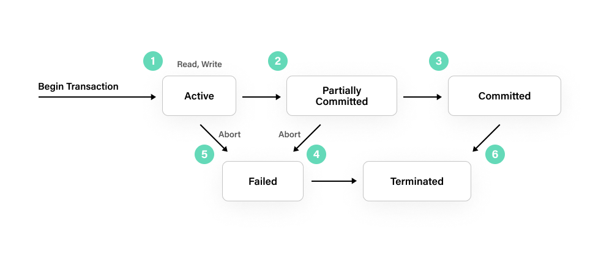

# Acid Database Transaction
An example demonstrating triggering a transaction failed state and demonstrating the ACID properties of a database transaction on sqlite3 with node.ts

### How the index.ts works
These are the steps that the index.ts file takes to trigger a transaction failed state and demonstrate the ACID properties:
1. Create a table for demonstration
```SQL
CREATE TABLE IF NOT EXISTS users (id INTEGER PRIMARY KEY AUTOINCREMENT, name VARCHAR(255) NOT NULL UNIQUE);
```
#### Trigger a explicit transaction failed state
2. Start a transaction
```SQL
BEGIN TRANSACTION;
```
3. Insert a user
```SQL
INSERT INTO users (name) VALUES ('Alice');
```
4. Insert a user with a duplicate name again to trigger a transaction failed state due to the unique constraint on the `name` column
```SQL
INSERT INTO users (name) VALUES ('Alice');
```
5. Commit the transaction
```SQL
COMMIT;
```
#### Trigger a implicit transaction failed state
3. Insert a user
```SQL
INSERT INTO users (name) VALUES ('Candice');
```
4. Commit the transaction
```SQL
COMMIT;
```
4. Insert a user with a duplicate name again to trigger a transaction failed state due to the unique constraint on the `name` column
```SQL
INSERT INTO users (name) VALUES ('Candice');
```
5. Commit the transaction
```SQL
COMMIT;
```
#### Trigger a autocommit transaction failed state
3. Insert a user
```SQL
INSERT INTO users (name) VALUES ('Bob');
```
4. Insert a user with a duplicate name again to trigger a transaction failed state due to the unique constraint on the `name` column
```SQL
INSERT INTO users (name) VALUES ('Bob');
```
5. Check the table to see the changes. In autocommit, even if the second insert failed, the first insert is still committed.
```SQL
SELECT * FROM users;
```
#### What is the difference between explicit and autocommit transactions?
From the output of the index.ts file, we can see that the autocommit transaction failed state although rolled back, the first insert is committed. While the explicit transaction failed state is rolled back, none of the insert is committed.

Expected output of `start.sh`:
```
Node.js is installed, version: v22.11.0
npm is installed, version: 10.9.0
npm install has been run before.
Table created successfully.
Inserting user `Alice`...
User `Alice` inserted successfully.
Inserting user `Alice` again...
Transaction rolled back due to error: UNIQUE constraint failed: users.name
Inserting user `Bob`...
User `Bob` inserted successfully.
Inserting user `Bob` again...
Transaction rolled back due to error: UNIQUE constraint failed: users.name
Users in the database: [ { id: 1, name: 'Bob' } ]
Database connection closed.
```

## How to run
```bash
./start.sh
```

## ACID Database Transaction Note
#### What is ACID?
- `Atomicity`: A transaction is an atomic unit of work that either completes or is not performed at all.
- `Consistency`: A transaction ensures that the database is always in a valid state before and after the transaction.
- `Isolation`: A transaction is isolated from other transactions, meaning that no other transaction can see the uncommitted changes of a transaction until it is committed.
- `Durability`: Once a transaction is committed, its changes are permanent and survive any subsequent failures.

#### What is ACID Database Transaction?
Transaction is a single unit of work. If a transaction is successful, all of the data modifications made during the transaction are committed and become a permanent part of the database. If a transaction encounters errors and must be canceled or rolled back, then all of the data modifications are erased.


source: https://fauna.com/blog/database-transaction

SQL Server operates in the following transaction modes[[1](https://learn.microsoft.com/en-us/sql/t-sql/language-elements/transactions-transact-sql?view=sql-server-ver16)]:
- `Autocommit transactions`
Each individual statement is a transaction.
- `Explicit transactions`
Each transaction is explicitly started with the BEGIN TRANSACTION statement and explicitly ended with a COMMIT or ROLLBACK statement.
- `Implicit transactions`
A new transaction is implicitly started when the prior transaction completes, but each transaction is explicitly completed with a COMMIT or ROLLBACK statement.